# Bharat ANPR

## About

Bharat ANPR is an offline-first Android application for detecting and reading Indian vehicle registration plates from a live camera preview. It is built as a modular prototype: camera capture, plate detection, image preparation, OCR, Indian-format parsing, multi-frame tracking, local history, and the Compose UI are separated so individual implementations can be replaced and improved.

The current build provides an end-to-end scanning pipeline, but its plate detector is a classical computer-vision fallback rather than a trained ANPR model. Treat recognition quality as experimental until it has been validated on representative road and device conditions.

## TL;DR

- Native Android app using Kotlin, Jetpack Compose, CameraX, Room, DataStore, Hilt, and coroutines.
- Processes camera frames on-device; ML Kit Latin text recognition is the currently injected OCR implementation. A Tesseract recognizer implementation and English data asset are also present.
- Detects candidate regions with a model-free vertical-edge heuristic, then crops, quality-checks, and enhances candidates before OCR.
- Parses standard Indian and Bharat-series registration formats, tracks candidates across frames, and saves finalized plate events to a local Room database.
- No sign-in, network permission, telemetry, or cloud OCR; plate-detection accuracy is limited by the heuristic detector and needs field validation.

## What is implemented

- **Live camera flow:** CameraX binds a rear-camera preview and image analysis to the activity lifecycle. A visible centered guide rectangle marks the scan region; frames are cropped to that region before detector inference. The ROI is mapped through the preview's `FILL_CENTER` transform so the guide and analyzed pixels align. `KEEP_ONLY_LATEST` avoids queuing stale frames; a frame throttle and single-flight guard limit work to at most two analysis submissions per second. Results from an in-flight frame are discarded when a newer frame arrived during inference, preventing a plate read from appearing after the camera has moved away.
- **Detection boundary and fallback:** `PlateDetector` defines the replaceable detector API. The current implementation scans reduced-resolution image regions for vertical-edge density, selects up to three non-overlapping candidates, expands their boxes, and assigns heuristic confidence. It uses no external detector weights.
- **Crop preparation:** Candidate boxes are clamped to the source frame before cropping. The quality gate checks minimum dimensions, brightness, edge-based sharpness, and aspect ratio. Accepted crops are resized; Otsu thresholding and small-angle rotation are tried as OCR alternatives when parsing the first result does not pass the format confidence gate.
- **On-device OCR:** The active Hilt binding is `MlKitPlateRecognizer`, using ML Kit's bundled Latin text-recognition model. The OCR interface is replaceable. A singleton, mutex-protected Tesseract implementation is included in the source, but is not the active binding.
- **Indian registration parsing:** Text is normalized to uppercase letters and digits. The parser recognizes standard state/district/series/number layouts and Bharat-series plates, validates state/UT prefixes, and applies character corrections according to the expected letter or digit segment.
- **Temporal tracking and duplicate suppression:** Bounding boxes are associated using intersection-over-union (IoU); recent observations contribute OCR, detector, crop-quality, and format-validity evidence to a temporal vote. Live scanning requires a complete four-digit standard plate serial (or the complete Bharat-series format) before a result can finalize, so a confidently read but visibly truncated fragment is not reported as a recognized plate. Finalization then requires at least two observations and a weighted confidence of at least 0.75. A configurable cooldown suppresses repeated database events for the same plate.
- **Local data and UI:** Finalized events are written to Room and exposed as a history flow. Jetpack Compose provides scanner, history, settings, and About screens. DataStore persists settings.
- **Dependency injection and tests:** Hilt provides application-scoped bindings for the detector, recognizer, database, and repository. JVM tests cover plate parsing, bounding-box behavior, and tracking; an Android launch test is also present.

## Technical implementation

```mermaid
flowchart LR
    A["CameraX preview and YUV analysis"] --> B["KEEP_ONLY_LATEST"]
    B --> C["Frame throttle and single-flight guard"]
    C --> D["Map centered preview guide<br/>to frame coordinates"]
    D --> E["Crop scan region"]
    E --> F["PlateDetector<br/>vertical-edge heuristic"]
    F --> G["Crop detection and image-quality gate"]
    G --> H["Resize<br/>optional threshold or rotation retry"]
    H --> I["PlateRecognizer<br/>active binding: ML Kit"]
    I --> J["Normalize, parse, and correct<br/>Indian registration format"]
    J --> K["IoU track association<br/>weighted temporal voting"]
    K --> L["Duplicate cooldown"]
    L --> M["Room plate history"]
    M --> N["Compose scanner and history UI"]
```



### Main code areas

| Area | Responsibility |
| --- | --- |
| `camera` | CameraX lifecycle binding, frame sources, YUV-to-bitmap conversion, and frame throttling |
| `detection` | Detector interface, detection geometry, and model-free heuristic implementation |
| `processing` | Bounding-box crop, image-quality scoring, resizing, thresholding, and rotation |
| `recognition` | OCR interface plus ML Kit and Tesseract implementations |
| `plate` | Normalization, Indian state/UT codes, segment-aware correction, and format parsing |
| `tracking` | IoU-based track association, weighted voting, and duplicate cooldown |
| `data` | Room entity/DAO/database and repository for local plate history |
| `settings` | DataStore-backed settings |
| `pipeline` | Background orchestration of detection through persistence |
| `ui`, `di` | Compose screens, ViewModel, and Hilt bindings |

See [ARCHITECTURE.md](ARCHITECTURE.md) for design notes, [TESTING.md](TESTING.md) for the device test checklist, [PERFORMANCE.md](PERFORMANCE.md) for performance notes, and [ENGINEERING_REPORT.md](ENGINEERING_REPORT.md) for verification status and known risks.

## Build and run

Prerequisites: JDK 17 and Android SDK platform 36. From the project root:

```bash
./gradlew testDebugUnitTest
./gradlew assembleDebug
```

Install `app/build/outputs/apk/debug/app-debug.apk`, grant camera permission, and scan a well-lit, near-horizontal plate. No sign-in or network connection is needed at runtime. For connected-device tests, run:

```bash
./gradlew connectedDebugAndroidTest
```

## Current limitations and next steps

- The edge-density detector is a safe, model-free integration baseline, not a plate-trained detector. Expect weak results with distant, skewed, blurred, reflective, dirty, occluded, night-time, and two-line motorcycle plates. It can return up to three candidates but does not reliably detect multiple vehicles.
- The active ML Kit model is general Latin text recognition, not a model trained specifically for Indian number plates. The included Tesseract implementation is not the active recognizer.
- Camera overlay alignment and recognition accuracy have not been validated across physical devices and aspect ratios. No emulator or physical-device validation is recorded in the engineering report.
- Settings for image saving, sound, vibration, debug overlay, and retention are persisted, but corresponding operational features such as saving crops and retention cleanup are not implemented. The current pipeline does not persist plate images or full camera frames.
- Before production use, replace the fallback detector with a legally sourced or trained plate-specific model, document its provenance and checksum, add a representative golden-image test set, validate camera transforms and lifecycle behavior on devices, and benchmark accuracy, latency, and thermal behavior.

## Privacy

Frame processing is local and in memory; full camera frames are not stored. Finalized recognition events are kept in the on-device Room database. The app does not request internet access and has no cloud OCR, account, analytics, or telemetry. Plate numbers may still be personal data, so deployments should define appropriate retention, access, and deletion policies.

## Licenses

Third-party dependency and model notices are documented in [THIRD_PARTY_LICENSES.md](THIRD_PARTY_LICENSES.md) and [MODEL_LICENSES.md](MODEL_LICENSES.md). Do not add model weights without verifying redistribution and training-data rights and recording the source, version, checksum, and license.
